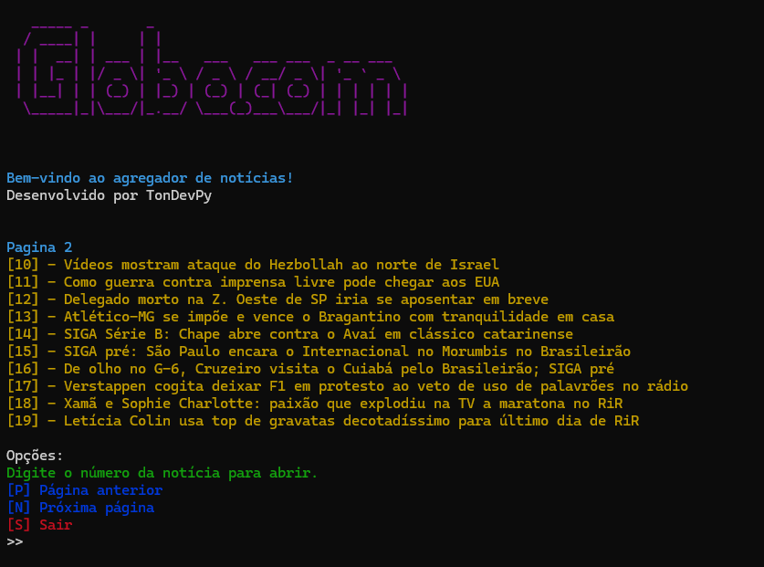

# 📰 Agregador de Notícias - Web Scraping

  

## 📖 Sobre o Projeto
Este projeto é um agregador de notícias simples que realiza scraping de manchetes de sites de notícias, permitindo a navegação por páginas diretamente no terminal e a abertura das notícias no navegador com um simples clique.

## 🚀 Funcionalidades
- Busca e exibe as manchetes mais recentes de sites de notícias.
- Navegação fácil entre as páginas de notícias diretamente no terminal.
- Abertura de links diretamente no navegador.
- Interface amigável e colorida com a biblioteca `colorama`.

## 🛠️ Tecnologias Utilizadas
- **requests**: Para realizar requisições HTTP aos sites de notícias.
- **BeautifulSoup**: Para realizar o parsing e scraping das informações.
- **colorama**: Para estilizar o terminal com cores.
- **webbrowser**: Para abrir automaticamente os links das notícias no navegador.
- **os**: Para limpar o terminal e gerenciar comandos do sistema.